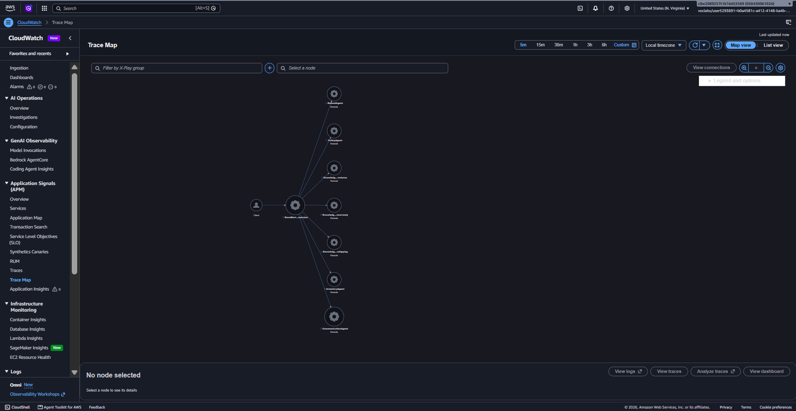
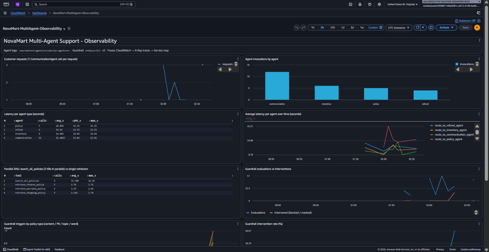

# Project: Enterprise Multi-Agent Customer Support with Amazon Bedrock AgentCore

**Udacity — AWS Agentic AI Nanodegree — Course 3, Capstone Project 3.3 (NovaMart)**

---

## Overview

A production-grade, multi-agent customer support system for **NovaMart**, a fictional
e-commerce company, built with the **Strands Agents SDK** and deployed on
**Amazon Bedrock AgentCore Runtime**.

The system automatically:

- understands a customer's request and **routes** it to the right specialist agent
- gathers **order and customer facts** from DynamoDB
- answers **policy questions** with **parallel multi-agent RAG** across three Bedrock Knowledge Bases
- makes **return / refund decisions** (30-day Standard, 60-day Premium window)
- composes a warm, professional **customer-facing reply**
- enforces **Bedrock Guardrails** (harmful content, PII, off-topic subjects, profanity, prompt attacks)
- is fully **observable** in CloudWatch Logs and AWS X-Ray

**Result: `python tests/test_agent.py all` → 120 / 120 (100%).**


## Architecture

```
Customer Request
      │
OrchestratorAgent  (Claude Haiku 4.5, temp 0.0)  ── routes + manages WorkflowState
      │
 ┌────┼──────────────┬──────────────┬───────────────────┐
InventoryAgent   PolicyAgent       RefundAgent    CommunicationAgent
(DynamoDB)       (multi-agent RAG) (decisions)    (final reply)
                      │
        ┌─────────────┼─────────────┐     ← ThreadPoolExecutor, in PARALLEL
 ReturnsPolicy   ShippingPolicy   WarrantyPolicy   RetrieverAgents
  Retriever       Retriever        Retriever
 (Returns KB)    (Shipping KB)    (Warranty KB)    ← Bedrock KBs on S3 Vectors

Shared state: DynamoDB WorkflowState table with optimistic locking (version check)
Safety:       Bedrock Guardrail v2 attached to every agent's model
Hosting:      AgentCore Runtime (PUBLIC, HTTP) · AgentCore Memory (session summary, 7 days)
Observability: CloudWatch Logs (INFO) + X-Ray (100% sampling, Transaction Search)
```

| Agent | Model / temp | Tools | Responsibility |
|---|---|---|---|
| **OrchestratorAgent** | Haiku 4.5 / 0.0 | `initialize_session`, `route_to_inventory_agent`, `route_to_policy_agent`, `route_to_refund_agent`, `route_to_communication_agent` | Routing only; never writes the reply itself |
| **InventoryAgent** | Sonnet 4.5 / 0.1 | `check_order_status`, `get_customer_tier`, `list_customer_orders` | Reports facts, never decides |
| **PolicyAgent** | Sonnet 4.5 / 0.2 (retrievers 0.0) | `search_all_policies` → 3 retriever sub-agents | Grounded policy answers |
| **RefundAgent** | Sonnet 4.5 / 0.1 | `get_inventory_context`, `initiate_refund` | Eligibility decision + return reference |
| **CommunicationAgent** | Sonnet 4.5 / 0.3 | `get_full_workflow_context` | Empathetic final response |

### Routing rules enforced by the orchestrator

| Rule | Trigger | Action |
|---|---|---|
| 1 | Every request (incl. follow-ups) | `initialize_session` first |
| 2 | Order status / return / refund | Inventory → Refund |
| 3 | Policy meaning questions | Policy |
| 4 | Account questions ("am I premium?") | Inventory — never Policy |
| 5 | Math / calculation | Straight to Communication |
| 6 | Every request (last) | Communication composes the reply |

## Project Structure

```
cs-bedrock-agentcore-chatbot-v3/
├── README.md                       ← this file
├── REFLECTION.md                   ← design decisions, challenges, production notes
├── src/
│   ├── agent_orchestrator.py       ← ⭐ implementation (Tasks 2, 3, 4, 6)
│   ├── agent_observability.py      ← provided: X-Ray tracing + CloudWatch logging
│   ├── agentcore_cli.py            ← provided: AgentCore CLI wrapper
│   ├── agent_utils.py              ← provided: terminal trace UI
│   ├── bedrock_kb_retrieval.py     ← provided: KB retrieval helper
│   └── demo.py                     ← provided: one end-to-end request
├── standout/                       ← stand-out extensions (see below)
├── docs/                           ← step-by-step study notes (Bahasa Indonesia)
├── screenshots/                    ← submission evidence
├── infrastructure/                 ← provided: CloudFormation stack, seed data, cleanup
├── tests/test_agent.py             ← provided: 120-point test suite
├── agentcore/                      ← provided: AgentCore CLI project (CDK)
├── config.py                       ← provided: configuration (CloudFormation exports + .env)
└── diagrams/                       ← provided: architecture diagrams
```

Only `src/agent_orchestrator.py` was modified among the provided files.
The original starter README is kept at [`docs/STARTER_README.md`](docs/STARTER_README.md).

---

## Part 1 — Infrastructure Setup

Prerequisites: Python 3.12, AWS CLI v2 (region `us-east-1`), Node.js 20+, `uv`, and
the AgentCore CLI `npm install -g @aws/agentcore@0.30.0`.

```bash
# 1. Foundation stack: DynamoDB tables, policy bucket, S3 Vectors bucket + 3 indexes,
#    execution role, log group
aws cloudformation deploy --template-file infrastructure/starter_stack.yaml \
  --stack-name udacity-agentcore --capabilities CAPABILITY_NAMED_IAM --region us-east-1

# 2. Python environment
py -3.12 -m venv venv && venv\Scripts\activate
pip install -r requirements.txt bedrock-agentcore

# 3. Seed data + configuration check   (Windows: set PYTHONUTF8=1 first)
python infrastructure/seed_data.py
copy .env.example .env
python config.py
```

Detailed notes: [`docs/01-setup-infrastruktur.md`](docs/01-setup-infrastruktur.md).

## Part 2 — Building the Agents (Task 2)

All five agents are implemented in `src/agent_orchestrator.py`. Each `build_*_agent()`
is self-contained: it creates its `BedrockModel` from the `config` model constants,
defines its tools with the traced `@tool` decorator (full docstrings with Args and
Returns), and returns exactly one `Agent`.

Highlights beyond the base requirements:

- **Parallel multi-agent RAG.** `search_all_policies` fans out to the three retriever
  sub-agents with `ThreadPoolExecutor(max_workers=3)` + `as_completed()`. A failing KB
  does not sink the other two. Latency ≈ the slowest retriever, not the sum.
- **Optimistic locking everywhere.** Every routing tool reads the WorkflowState, runs
  its worker, then writes with `_update_workflow_state(..., expected_version=...)`.
- **Deterministic safety net for refunds.** `initiate_refund` re-checks the tier window
  in code and uses a DynamoDB condition (`status = delivered`), so an ineligible or
  already-returned order can never be modified, even if the LLM is wrong. Repeated
  requests are idempotent.
- **No cross-customer leakage.** Workers are reused across requests, so their history
  is cleared before each call (`_run_worker`).
- **Strict sequencing.** The orchestrator uses `SequentialToolExecutor` so Refund
  never runs before Inventory finishes.
- **Multi-turn sessions.** `initialize_session` on an existing session starts a new
  turn instead of failing.

Detailed notes: [`docs/02-multi-agent-graph.md`](docs/02-multi-agent-graph.md).

## Part 3 — Guardrail, Runtime, Memory, Knowledge Bases, Observability

| Task | Implementation | Notes |
|---|---|---|
| **3 Guardrail** | `create_guardrail()` + `_guardrail_policies()` | Content (HIGH / MEDIUM), PII (BLOCK cards and SSN, ANONYMIZE email and phone), 3 DENY topics on the **STANDARD** tier with the `us.guardrail.v1:0` cross-region profile, managed profanity list, published **numbered version**. Pricing negotiation is defined narrowly so the math scenario is allowed. [docs/03](docs/03-guardrail-dan-runtime.md) |
| **3 Runtime** | `deploy_to_agentcore_runtime()` | 8 runtime env vars → `configure_runtime(PUBLIC, HTTP, stack execution role)` → `agentcore deploy` → ARN |
| **4 Memory** | `configure_memory()` | `summaryMemoryStrategy`, `eventExpiryDuration=7`, name + description, idempotent `clientToken`. [docs/04](docs/04-memory.md) |
| **5 Knowledge Bases** | AWS Console | 3 self-managed KBs, Titan Text Embeddings V2 (1024), S3 Vectors bucket from the stack + matching index, synced. [docs/05](docs/05-knowledge-bases.md) |
| **6 Observability** | `configure_observability()` | CloudWatch `INFO` → `/aws/bedrock/agentcore/udacity-agentcore`, X-Ray `samplingRate=1.0`, wrapped in `try/except`. [docs/06](docs/06-observability.md) |

```bash
python src/agent_orchestrator.py deploy     # 6-step pipeline, first run ~15 min (CDK bootstrap)
```

Deployed resources (values in the local `.env`, which is git-ignored):

| Variable | Value |
|---|---|
| `RETURNS_KB_ID` / `SHIPPING_KB_ID` / `WARRANTY_KB_ID` | `9I6I8WHGH1` / `XXS6MXFVYE` / `JF9F9JB9H0` |
| `AGENTCORE_RUNTIME_ARN` | `arn:aws:bedrock-agentcore:us-east-1:<account>:runtime/udacity_agentcore_runtime-wPMVH22Dlt` |
| `GUARDRAIL_ID` / `GUARDRAIL_VERSION` | `etk8zyzrz5il` / `2` |
| AgentCore Memory | `udacity_agentcore_memory-TnpYeREsam` (ACTIVE) |

---

## Testing & Evidence

### Automated test suite — 120 / 120

```bash
python tests/test_agent.py all
```


### End-to-end scenarios (deployed runtime)

```bash
python src/agent_orchestrator.py invoke "I want to return my order ORD-27176" CUST-001
python src/agent_orchestrator.py invoke "What is the return policy for premium customers?" CUST-002
python src/agent_orchestrator.py invoke "How much are 5 items at $29.99 with 10% off?" CUST-003
```

| Scenario | Routing observed | Reply (summary) |
|---|---|---|
| Return ORD-27176 (CUST-001, Premium) | Orchestrator → Inventory → Refund → Communication | Approved: delivered 7 days ago, within 60 days, RMA reference, refund $149.99 in 5–7 business days |
| Premium return policy | Orchestrator → Policy (3 KBs in parallel) → Communication | 60-day window, eligibility rules, return process |
| 5 × $29.99 with 10% off | Orchestrator → Communication | $149.95 − $14.995 = $134.955 → **$134.96** |
| Return ORD-28001 (CUST-002, Standard, 40 days) | Orchestrator → Inventory → Refund → Communication | Denied empathetically, warranty claim offered |
| "Am I a premium member?" (CUST-002) | Orchestrator → Inventory → Communication | Standard tier (Policy agent not used, Rule 4) |

### X-Ray Service Map

`python src/agent_orchestrator.py test` → CloudWatch → X-Ray traces → Service map:



---

## Stand-out Suggestions Implemented

| Suggestion | Implementation | Evidence |
|---|---|---|
| **Adversarial guardrail validation** | [`standout/guardrail_adversarial_test.py`](standout/guardrail_adversarial_test.py): 18 benign and adversarial cases via `ApplyGuardrail` + `--live` cases through the deployed runtime | [`standout/guardrail_report.md`](standout/guardrail_report.md). Finding: v1 let prompt-injection through, so a `PROMPT_ATTACK` filter was added (v2) → 18/18 |
| **Persistent conversation memory (DynamoDB)** | [`standout/dynamodb_session_manager.py`](standout/dynamodb_session_manager.py): a DynamoDB `SessionRepository` for Strands (the SDK ships only file/S3), `agent-sessions` table (single-table design, TTL 7 days), wired into the Orchestrator via `build_orchestrator_agent(..., session_manager=...)`; [`standout/chat_with_memory.py`](standout/chat_with_memory.py) resumes a chat from any process | Follow-up "how long is the warranty on **it**?" in a new process → resolved to ORD-27176 and answered for a Premium customer (3 years) |
| **CloudWatch dashboard** | [`standout/create_dashboard.py`](standout/create_dashboard.py): `NovaMart-MultiAgent-Observability` with requests over time, invocations per agent, avg/p95 latency per agent type, parallel-RAG latency, guardrail triggers by policy type + intervention rate, runtime invocations/latency/errors |  |

Details and how-to: [`docs/08-standout.md`](docs/08-standout.md).

---

## Rubric Mapping

Line numbers refer to `src/agent_orchestrator.py`.

### Multi-Agent Graph

| Criterion | Where |
|---|---|
| `build_inventory_agent()` with 3 tools, Sonnet 4.5, temp 0.1 | `:287` (tools `:333`, `:366`, `:388`; model `:296-298`) |
| `build_refund_agent()` with `get_inventory_context` + `initiate_refund`, 30/60-day windows | `:423` (tools `:476`, `:498`; windows `RETURN_WINDOW_DAYS` `:219`) |
| `build_communication_agent()` with `get_full_workflow_context`, temp 0.3 | `:781` (tool `:828`; temp `:792`) |
| Tool docstrings (purpose, Args, Returns) | every `@tool` in the file |
| 3 retriever sub-agents with the correct KB IDs, temp 0.0 | `:606-672` (`ReturnsPolicyRetrieverAgent` `:620`, `ShippingPolicyRetrieverAgent` `:643`, `WarrantyPolicyRetrieverAgent` `:666`) |
| `search_all_policies` with `ThreadPoolExecutor(max_workers=3)` + `as_completed()` | `:675` (`:725`, `:730`) |
| PolicyAgent coordinator temp 0.2 | `:748` |
| Orchestrator Haiku 4.5 temp 0.0, six routing rules | `:861` (model `:878-880`; rules `:892-910`) |
| `initialize_session` creates WorkflowState | `:1060` |
| Routing tools read state → worker → `_update_workflow_state(expected_version=...)` | `_invoke_and_record` `:968-981`; tools `:983-1058` |
| Communication agent always last; orchestrator never writes the reply | prompt `:942` |
| `python tests/test_agent.py task2` | 40/40 |

### AgentCore Runtime and Guardrails

| Criterion | Where |
|---|---|
| Content / PII / topic / word policies | `_guardrail_policies()` `:1187` |
| `create_guardrail_version()` → numbered version; returns `(id, version)` | `create_guardrail()` `:1287` (`:1322`) |
| Deploy via `configure_runtime` / `deploy` / `deployed_runtime_arn` | `deploy_to_agentcore_runtime()` `:1343` (`:1398`, `:1406`, `:1409`) |
| PUBLIC, HTTP, stack execution role, 8 env vars incl. numbered `GUARDRAIL_VERSION` | `:1382-1403` |
| `.env` has `AGENTCORE_RUNTIME_ARN`; `task3` passes | 20/20 |

### Memory and Knowledge Bases

| Criterion | Where |
|---|---|
| `create_memory()` with `summaryMemoryStrategy`, `eventExpiryDuration=7`, name + description; returns `memoryArn` | `configure_memory()` `:1426` (`:1445-1458`) |
| 3 KBs (Titan V2, S3 Vectors + matching index, synced), IDs in `.env` | [`docs/05-knowledge-bases.md`](docs/05-knowledge-bases.md); `task5` 25/25 |
| Parallel retrieval returns results from all 3 KBs | `test_5_4_parallel_retrieval` ✓ |

### Observability

| Criterion | Where |
|---|---|
| `loggingConfiguration` → `apply_observability_config()` in `try/except` | `configure_observability()` `:1482` |
| CloudWatch INFO + enabled; X-Ray enabled, `samplingRate=1.0` | `:1494-1508`; `task6` 20/20 |
| X-Ray Service Map screenshot | [`screenshots/xray_service_map.png`](screenshots/xray_service_map.png) |

### Industry Best Practices

| Criterion | Where |
|---|---|
| Model IDs only from `config.ORCHESTRATOR_MODEL_ID` / `config.WORKER_MODEL_ID` | every `BedrockModel(...)` |
| Self-contained builders, one `Agent` each, snake_case names | `build_*_agent()` |

---

## Submission Checklist

- [x] `src/agent_orchestrator.py` — all TODOs implemented (Tasks 2, 3, 4, 6)
- [x] Three Bedrock Knowledge Bases created and synced (Task 5)
- [x] `.env` populated (KB IDs, runtime ARN, guardrail ID + numbered version)
- [x] Screenshot: `python tests/test_agent.py all` → 120/120
- [x] Screenshot: X-Ray Service Map

## Study Notes (Bahasa Indonesia)

| | |
|---|---|
| [00 Gambaran besar](docs/00-gambaran-besar.md) | [05 Knowledge Bases](docs/05-knowledge-bases.md) |
| [01 Setup infrastruktur](docs/01-setup-infrastruktur.md) | [06 Observability](docs/06-observability.md) |
| [02 Multi-agent graph](docs/02-multi-agent-graph.md) | [07 Testing & submission](docs/07-testing-dan-submission.md) |
| [03 Guardrail & runtime](docs/03-guardrail-dan-runtime.md) | [08 Stand-out](docs/08-standout.md) |
| [04 Memory](docs/04-memory.md) | [09 Troubleshooting](docs/09-troubleshooting.md) |

## Clean Up (after grading)

```bash
python infrastructure/cleanup.py --yes
python standout/create_dashboard.py --delete
python standout/dynamodb_session_manager.py delete-table
```

## References

- [Strands Agents SDK](https://strandsagents.com) · [Amazon Bedrock AgentCore](https://docs.aws.amazon.com/bedrock-agentcore/latest/devguide/) · [AgentCore CLI](https://github.com/aws/agentcore-cli)
- [Bedrock Knowledge Bases](https://docs.aws.amazon.com/bedrock/latest/userguide/knowledge-base.html) · [Bedrock Guardrails](https://docs.aws.amazon.com/bedrock/latest/userguide/guardrails.html) · [Safeguard tiers](https://docs.aws.amazon.com/bedrock/latest/userguide/guardrails-tiers.html)
